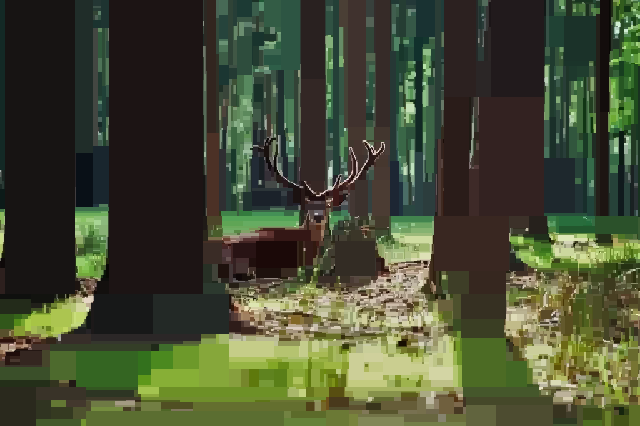

# Pixelate Image Filter
Pixel Art Filter is an image filter that pixelates PNG images using a lossy image compression algorithm, written in C++ using g++ and LodePNG.

## Deployment
To compile the project, use the command:
```
make
```
And once that is finished, run the project using:
```
./pixelate.exe
```
Once this is completed the output will be in the images/ folder.

##Change pixelation effect
To add your own images, add PNG files to the images/ folder.

Go to main.cpp and modify the parameters:
```C++
origImg1.readFromFile("images/photo.png");
```
To play with the pixelation effect, modify the parameters:
```C++
t1.prune(0.99, 8500);
```
Finally, to change the output image names, modify the parameters:
```C++
pic1.writeToFile("images/output-photo.png");
```
##Before:


##After
